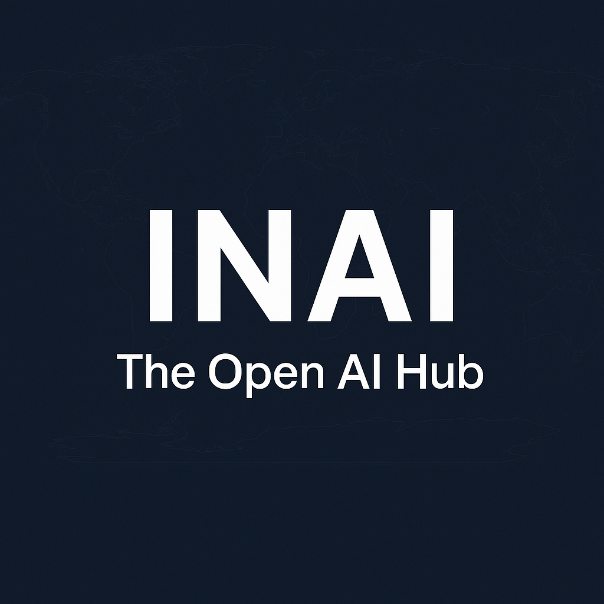

# 🌍 INAI • The Open AI Hub

  

  <!-- Live repo badges -->
  
  
  
  
  

  
  
  

⭐ <b>Star this repo to support the open Wikipedia of AI</b> ⭐  
 2M+ apps, agents, MCP servers, LLMs, Chrome extensions, tutorials & daily news — free & open

---

## ✨ What is INAI?
**INAI = Intelligence Atlas** — the **open, ever-growing Wikipedia of AI**.  
Not just a blog or a list; it’s a **living map of the AI ecosystem**.  

- 📰 **AI News Daily** → curated from 250+ sources & 500+ experts  
- 🛠️ **Apps & Tools** → 2M+ product entries indexed  
- 🤖 **Agents** → frameworks, platforms, productivity bots  
- 🧩 **MCP Servers** → Model Context Protocol ecosystem  
- 🧪 **Chrome Extensions** → AI-powered browsing add-ons  
- 🧠 **LLMs & Models** → Hugging Face, fine-tunes, evals  
- 📚 **Tutorials & Guides** → reproducible workflows & how-tos  
- 🎙️ **Podcast** → AI News Daily on Spotify & Apple  

---

## 🔎 Explore INAI
**News & Updates**
- 📰 [AI News Daily](docs/news.md)  
- 🐦 [Twitter AI Digest](docs/twitter-news.md)  
- 📢 [Reddit AI Highlights](docs/reddit-news.md)  
- 💻 [Hacker News (AI)](docs/hacker-news.md)  
- 🗓️ [Weekly Archives](docs/weekly.md)  

**Applications & Knowledge**
- 🛠️ [AI Apps & Tools](docs/apps.md)  
- 🤖 [AI Agents](docs/agents.md)  
- 🧩 [MCP Servers](docs/mcp.md)  
- 🧪 [Chrome Extensions](docs/extensions.md)  
- 🧠 [LLMs & Models](docs/llms.md)  
- 📚 [Tutorials & Guides](docs/tutorials.md)  

---

## 🔥 Recently Added
We **add new content daily** — fresh apps, agents, and LLMs to keep you ahead.  

- ➡️ [See the Latest Additions](https://inai.short.gy/12th-sept)

> INAI’s **2M+ AI Database** is alive and growing — every day.

---

## 💎 Why INAI?
- 🌍 **Global** → apps, models, datasets, research, tutorials  
- 🕑 **Real-time** → refreshed daily  
- 📈 **Scale** → 2,000,000+ resources indexed  
- 🎯 **Curated** → tagged, summarized, de-duplicated  
- 💡 **Free & Open** → non-commercial, attribution required  

---

## 🎧 Podcast
- 🎙️ [AI News Daily Podcast](https://ainews.buzzsprout.com)  

---

## 📅 Roadmap
- ✅ Daily AI News + Weekly archives  
- 🚀 Public release of **Apps/Tools Directory**  
- 🚀 Expansion: **Agents, MCP Servers, Chrome Extensions, LLMs**  
- 🚀 Showcase: **Latest Additions** (auto-updated feeds)  
- 🚧 Public API & Global Search  

---

## 🤝 Contribute
You can help right now:  
- ⭐ **Star** this repo — it signals interest & boosts discovery  
- 📰 Share news/tools/tutorials via **Issues**  
- 🔧 Open PRs for fixes, tags, or new sources  
- 📣 Spread the word on **X / Reddit / HN / LinkedIn**  

---

## ⚖️ License
[CC BY-NC 4.0](LICENSE.md) — free with attribution, non-commercial use only.  
See [TERMS.md](TERMS.md) for fair-use & API access.  

---

🌍 <b>INAI = Intelligence Atlas</b> — the open Wikipedia of AI.  
 ⭐ Star us to support the mission.  

